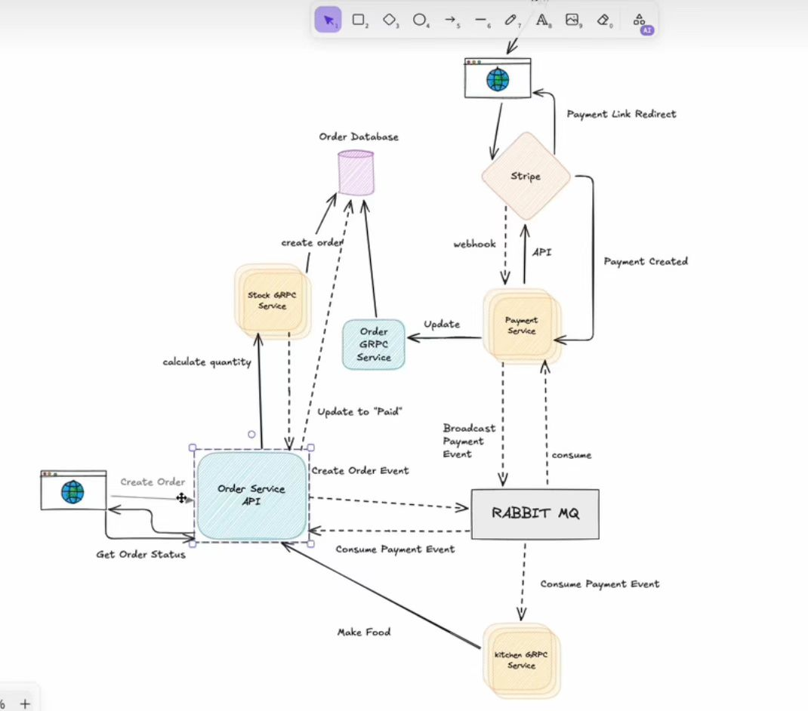

[](https://opensource.org/licenses/MIT)

<!--  -->

English | [简体中文](README_cn.md)

# Gorder

Gorder-v2 是一个分布式微服务电商订单系统，涵盖订单、库存、支付、厨房等核心业务模块，支持高并发、可观测性、服务注册与发现、消息队列等现代云原生特性，适合学习与生产环境实践。

## ✨ 特性

1. 多业务模块：订单、库存、支付、厨房服务解耦，独立扩展
2. 云原生支持：服务注册发现（Consul）、链路追踪（Jaeger）、监控（Prometheus & Grafana）
3. 多存储后端：MySQL、MongoDB、Redis
4. 高并发与可靠性：消息队列（RabbitMQ）、分布式架构
5. 丰富脚本与一键部署：Docker Compose、初始化脚本

## 🏗️ 架构



## 🚀 快速开始

### 环境准备

- 安装 Docker 和 Docker Compose
- Go 1.18+（如需本地开发）

### 启动依赖服务

```bash
docker-compose up -d
```

### 初始化数据库

- MySQL 会自动执行 `init.sql`

### 启动微服务

```bash
cd internal/order && go run main.go
cd internal/stock && go run main.go
cd internal/payment && go run main.go
cd internal/kitchen && go run main.go
```

### 访问服务

- Consul UI: http://localhost:8500
- RabbitMQ UI: http://localhost:15672
- Jaeger UI: http://localhost:16686
- Prometheus: http://localhost:9090
- Grafana: http://localhost:3000
- 订单 HTTP API: http://localhost:8282/api

## 📂 目录结构

```text
api/                # 通信协议（OpenAPI, Protobuf）
internal/           # 核心微服务实现
public/             # 前端静态资源
prometheus/         # Prometheus 配置
scripts/            # 脚本工具
docker-compose.yml  # 一键启动所有依赖服务
init.sql            # MySQL 初始化脚本
```

```bash
make test
make lint
```

## 📝 License

Gorder-v2 遵循 [MIT License](LICENSE)
